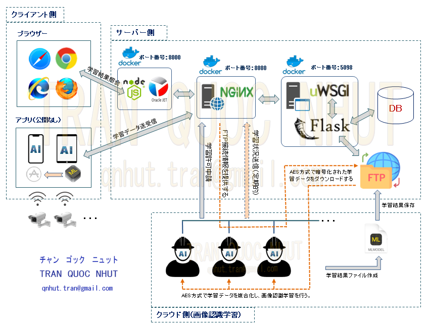
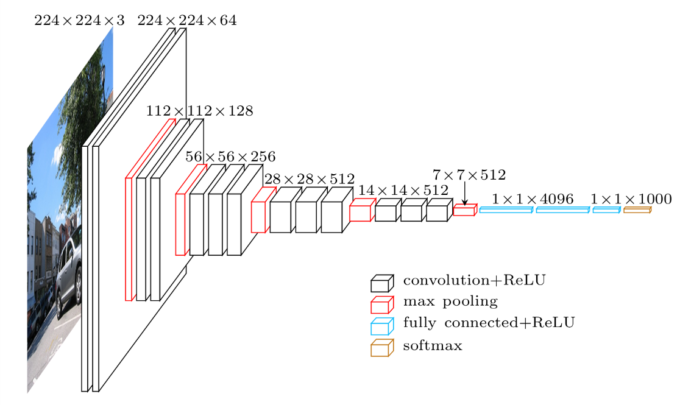

# フロー図

# フォルダー構築
> KerasNodeJs 
>　|_ KerasServer（サーバー側） 
>　|　　　|_ bridge（公開なし） 
>　|　　　|_ nginx（公開なし） 
>　|　　　|_ nodejs（サーバーサイド） 
>　|　　　|_ uwsgi（APIサービス） 
>　|_ KerasClient（クラウド側） 
>　|　　　|_ traindata（公開なし） 
>　|　　　|_ trainapp（AIワーカー） 
>　|_ KerasApp（スマホアプリ-公開なし） 
>
> ※docker-compose.yml、Dockerfileなども公開なし

# 説明
### ① サーバー側
■ Nginx + uWSGI + FlaskでAPIサービスを動かす。
- nginx: Nginxを通じてHTTPクライアントからのリクエストを認証し、uWSGIに転送する。 
※不正なアクセスリクエストである場合、クライアント側へエラー「401」を自動返却する。
- uwsgi: APIサービス（uWSGI + Flask）として下記を処理させて、クライアント側へ結果を返却する。 ※学習用画像データ、ログイン情報などの重要なデータはAES方式で暗号化される。
    - ログインAPI、ログアウトAPI
    - ログイン状況認証API
    - 学習状況監視、画像データ閲覧などのデータ抽出API
    - データ登録API
    - データ更新API
    - データ削除API
    - 本人の活動履歴記録API
    - 本人の活動履歴分析・健康状況予測API 
    ※SVMモデルを用いて健康状況予測を行う予定。
    - 学習用画像データアップロードAPI
    - 学習データ作成API（pickle拡張子のファイル作成）
    - 本人認識用データダウンロードAPI（MLModelファイル）
- bridge: H5, MLModel等の学習資材を管理するフォルダーである。
- 環境構築：Docker, Nginx, uWSGI, Flask
- 開発言語：Python 3.8

### ② クラウド側（画像認識学習）
- traindata: 学習データおよび学習結果データを保存するフォルダーである。 
- trainapp: 非同期タスクで、AIワーカーとして定期的に動かすようにする。 
    - 学習データはAES方式で暗号化されたpickle拡張子のファイルであるため、 
    FTPからダウンロードした後、AES方式で学習データを複合化し、画像認識学習を行う。
    - 複数のAIワーカーが同時に学習できるが、同時学習可能な回数を超える場合は、 
    CPUメモリがオーバーされる可能性があるため、超過分が次回学習待ち状態にする。 
    - 画像認識学習終了後、学習結果(H5, MLModelなど)をサーバー側（FTPサーバー）へ再送し、 クラウド側で学習データを全て削除する。
- 環境構築: Docker, Redis, Celery
- 開発言語: Python 3.8
- ディープラーニング方法: OpenCV + Keras (VGG16モデル, VGG19モデルなど)
- モデルイメージ 
    

### ③ クライアント側
- ブラウザー 
    - nodejs: Node.js上のフレームワークを用いてOracle JET Webアプリケーションである。 
        - ログインできた場合は暗号化済みクッキー情報をクライアント側へ返却する。 
        - サーバー側ではNginxを通じてログイン状況認証が自動で行われるため、 
        クライアント側のクッキー情報が不正な場合は、不正なアクセス通知がクライアント側へ自動的に送信され、ログイン画面へ遷移される。
    - 環境構築: Docker, Node.js
    - 開発言語: Oracle JET, Knockout, Linq
- スマホアプリ（公開なし） 
    - AIワーカーが学習したデータ(MLModel)により、本人認識を行い、活動状態を記録するアプリである。
    - 本人の活動履歴（グラフ表）はブラウザー・スマホアプリの両方から閲覧できる。
    - 開発言語: Swift, Object-C
    - 物体検知技術: OpenCV DNNを採用する。
